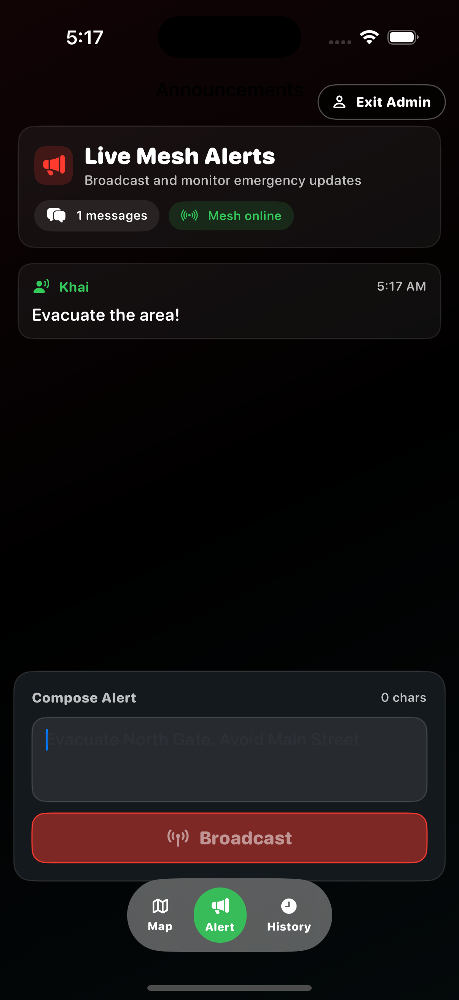
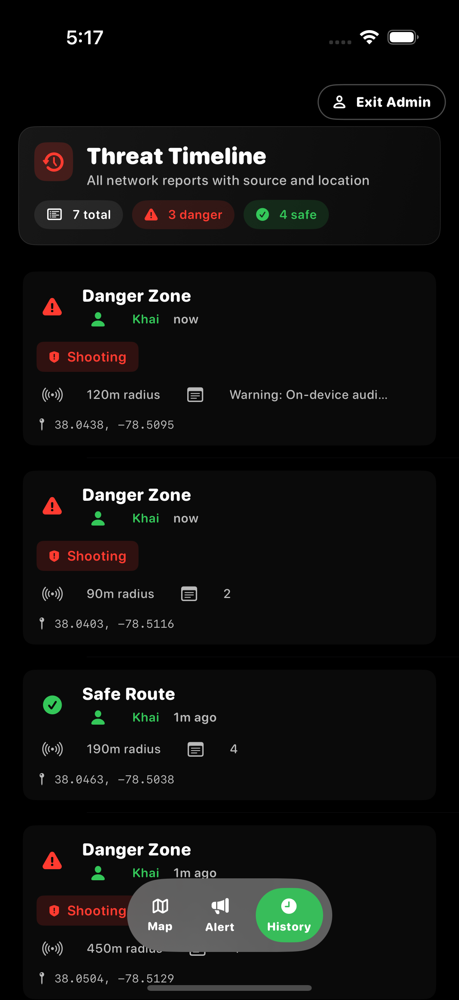

# Surviv

<p align="center">
  
</p>

Surviv is an offline-first crisis response app for iOS. It lets nearby phones form a local mesh to share warnings, map threats, and coordinate safer movement when cellular and internet access are unreliable or unavailable.

<p align="center">
  
</p>

## Problem

During outages and infrastructure disruption, people lose trusted, timely information first. Without that signal, communities cannot quickly verify threats or coordinate safe decisions.

## Solution

Surviv delivers three core capabilities on-device:

- Mesh alerts: multi-hop peer-to-peer broadcast with no internet dependency.
- Shared hazard map: danger and safe-route pins synchronized across nearby peers.
- On-device AI detection: microphone classification that can auto-create danger alerts.

## Why It Wins

- Works offline by default.
- Designed for fast decisions under stress.
- Converts raw events into map-level guidance.
- Uses commodity phones with no extra hardware.

## Inspiration

Recent local and global conflicts highlighted a simple need: civilians need a direct way to warn each other when centralized systems are slow, unavailable, or compromised. Surviv was built to support community-to-community protection using the devices people already carry.

## How It Works

- Networking: Multipeer mesh relay with dedup and hop limits.
- Mapping: shared hazard model with timestamped history.
- AI: PyTorch training pipeline exported to Core ML for on-device inference.
- Persistence: SwiftData for continuity when links drop.

## Challenges and Tradeoffs

- Hardest problem: separating normal city audio from true danger classes such as gunfire and shelling.
- Current model performance: around 81% accuracy and 85% recall.
- We bias toward over-warning: false positives are more acceptable than missed threats in high-risk settings.

## What We Are Proud Of

- Built a clear interface without sacrificing speed.
- Shipped an end-to-end iOS + mesh + AI pipeline as a student team.
- Focused the product on practical civilian coordination, not demo-only features.

## What We Learned

- Swift and SwiftUI application engineering at production depth.
- Low-latency peer relay design using Apple networking primitives.
- Reliable on-device ML deployment from PyTorch to Core ML.

## Tech Stack

- iOS: SwiftUI, MapKit, SwiftData, CoreLocation, AVFoundation, MultipeerConnectivity, Core ML
- AI: Python, PyTorch, torchaudio, NumPy

## Quick Start

### Run iOS App

1. Open ios-app/surviv.xcodeproj in Xcode.
2. Build and run on simulator or device.
3. Grant microphone and location permissions.

### Run AI Pipeline

```bash
python3 -m venv .venv
source .venv/bin/activate

pip install --upgrade pip

pip install -r requirements.txt

cd ai-engine

python train_mad.py --data-root MAD_dataset --epochs 30 --out-dir mad_runs/default

python test_mad.py --checkpoint mad_runs/default/best.pt --data-root MAD_dataset

python live_mic_mad.py --checkpoint mad_runs/default/best.pt
```

Optional Core ML export:

```bash
pip install coremltools

python export_mad_coreml.py --checkpoint mad_runs/default/best.pt --out MADMelCNN.mlpackage
```

## What Is Next

- Expand map support from a single local region to city-scale partitioned areas.
- Delivery confirmation for critical alerts.
- Report credibility scoring across multiple peer confirmations.
- End-to-end encrypted payload exchange.